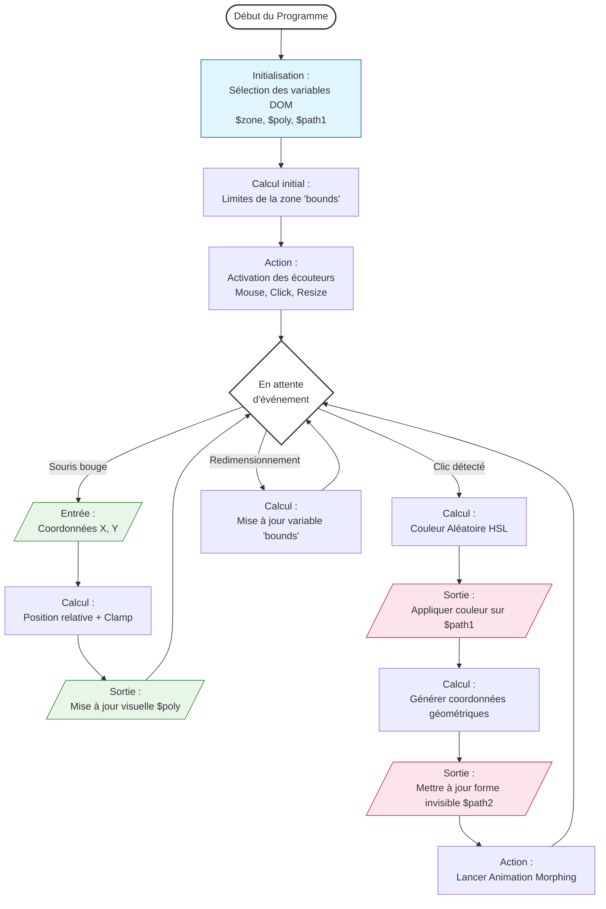

# Projet de développement

## Choix de projet 

Mon projet de développement consistera à une animation Javascript d'une forme qui suivra le curseur de la souris 
(https://animejs.com/documentation/animatable/)

## Étapes principales
### Objectifs
En dehors de l'objectif d'avoir une animation fonctionnelle qui suit le curseur, la forme devra :
- Changer de couleurs périodiquement 
- changer de forme après un clic de souris 

## Conception 18/11 
### Outils 
- Visual Studio Code
- JsBin 
- Gemini 2.5 Pro
- Reddit
- Youtube
- Stack Overflow

### Méthode de travail
- Expérimentation sur JsBin pour visualiser la page et éditer le code
- Débogage sur Visual Studio Code 
- S'il y a un blocage d'utilisation de Gemini pour mieux comprendre le code, expliquer et corriger.
- retour à expérimenter sur Jsbin
https://gemini.google.com/share/c3b671215c15

### Réalisation 
- Lecture de la bibliographie d'animejs
- Explication du fonctionnement de chaque code
  "Explique en détail le fonctionnement du module anime.js ["morpheTo"](https://animejs.com/documentation/svg/morphto)
- Essaie sur Jsbin du deuxième code (https://animejs.com/documentation/animatable) en prenant la base du 1er code (à partir d'import).
  "Explique en détail le fonctionnement du module anime.js ["createAnimatable"](https://animejs.com/documentation/animatable)
- Tentative de création des 2 codes en 1
  "Est-ce qu'il est possible de lier les deux codes pour faire  en sorte que "
- Demande à Gemini d'expliquer chaque étape du code avec le prompt "explique comment fonctionne chaque étape de ce code"
- rédaction du code sur les mouvements de la souris basé sur le code gemini mais modification des valeurs const zone et poly manuellement 
- Modification du SVG manuellement
- utilisation d'un math random pour générer 6 chiffre pour code HEX
- random.color créé par Visual Studio Code et modifié manuellement
- Prompt sur Gemini "Ajoute un paramètre pour modifier la forme du polygone à chaque clic de souris"

## Flowchart

### Axe d'amélioration 
- Ajouter des commentaires plus clairs qui explique bien le code
- Modifier le SVG pour qu'il prenne soit toute la page, soit qu'il soit dans un rectangle avec une animation du polygone moins grand (résolution du conflit entre les pixels du polygone et les pixels du SVG soit création d'un id pour le SVG et formatage CSS dans <style> avec taille fixe en px ou vh/vw).
- Créer un <background> qui change de couleur en fonction de la taille de la fenêtre dans <style> avec valeur px min et max

