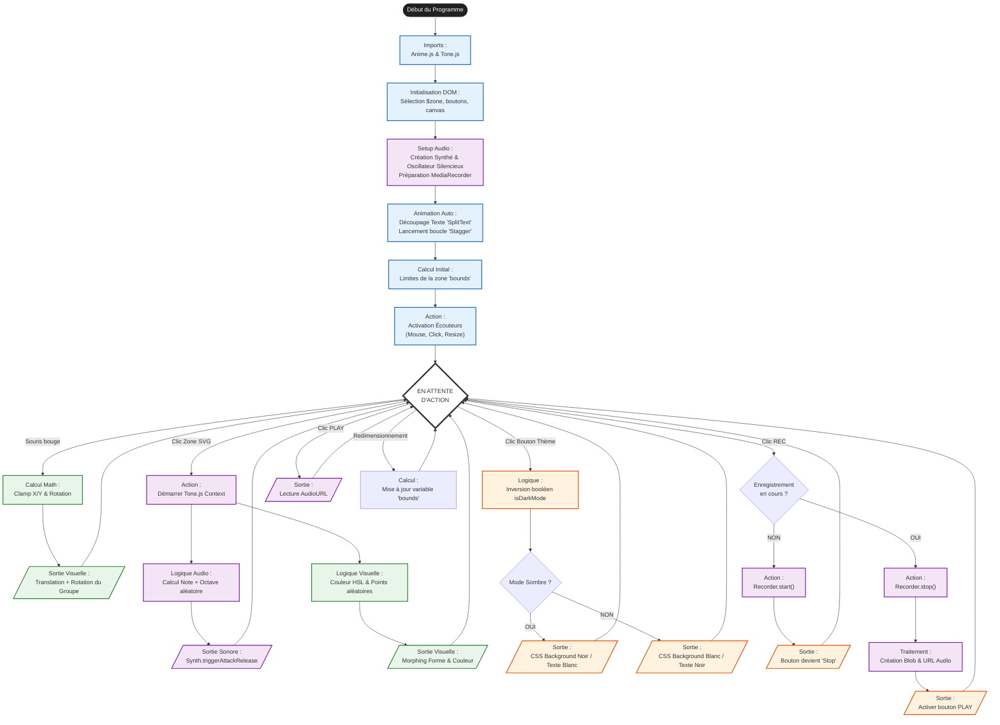

# Version finale testprojet6
## Objectifs
- Implémenter des boutons pour enregistrer et lire les sons produits par Tone.js 
- ajouter un bouton pour un mode sombre et clair
- animer un texte avec anime.js 

## Outil
Visual Studio
JSbin
Gemini 3.0 mode raisonnement 

## Source 
- [Using On-Screen Buttons & Sliders to control Tone and P5](https://www.youtube.com/watch?v=kyJoJy2CpJc)
- [Sound triggering, FX and Recording with Tone.js: HTML/CSS/Javascript](https://www.youtube.com/watch?v=QklWIeZLZYY)
- [Anime.JS splittext](https://animejs.com/documentation/text/splittext/textsplitter-settings/lines)

## Réalisation 
- Modification manuelle pour l'animation du texte avec l'ajout dans import de "stagger, splitText" et des codes CSS et JS d'exemple avec des modifications pour que le code s'applique au texte ".instruction" 
- Modification de la taille du bouton à 120px de long

Prompt 
- "Vérifie que les modules stagger et splitText soient bien intégrés au code"
- "Ajoute un bouton qui permet de modifier l'arrière-plan avec un thème sombre ou clair sur le haut de l'écran"
- "Ajoute sur la gauche du bouton thème deux boutons pour enregistrer et lire les sons de Tone.js. Respecte le rythme de clic de la souris pour que les silences entre deux clics soient enregistrés aussi" 

## Flowchart

## Conclusion 
Mon objectif était de créer une animation avec les modules anime.js Animatable et MorpheTo, avec une animation qui change de couleur au hasard et une animation déclenchée au clic.
L'une des plus grandes difficultés a été de faire en sorte que l'animation de morpheTo ne rentre pas en conflit avec le calcul du mouvement du polygone avec la souris. La taille du SVG a aussi été un problème puisque le ratio d'écran impacte la taille du polygone et son déplacement. 
Ma version finale respecte bien plus le mouvement que je voulais et est bien plus fidèle à l'animation Animatable. 
